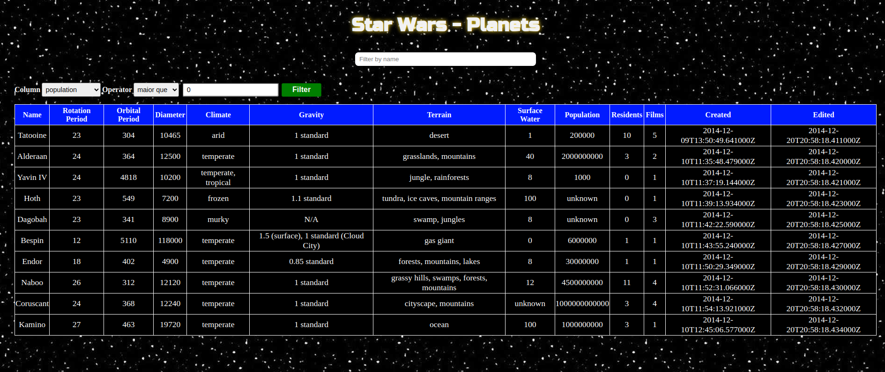

# Star Wars - Planets

## Descrição 

Esse foi um dos projetos que realizei na [Trybe](https://www.betrybe.com/), nele desenvolvi uma lista com filtros de planetas do universo de Star Wars usando **Context API e Hooks** para controlar os estados globais da aplicação.
Para ter acesso basta clicar [neste link]().

## Habilidades

Neste projeto, verificou-se minhas habilidades de:

- Utilizar a _Context API_ do **React** para gerenciar estado.
- Utilizar o _React Hook useState_;
- Utilizar o _React Hook useContext_;
- Utilizar o _React Hook useEffect_;
- Criar _React Hooks_ customizados.

## Resultado



## Tecnologias utilizadas

- `React`
- `Styled Components`

## Como instalar esse projeto localmente na sua máquina

Antes de tudo é preciso fazer o clone do projeto para sua máquina (é necessário ter o git instalado), escolha uma pasta no seu pc, entre nela e pelo terminal execute o seguinte comando:

```bash
git clone https://github.com/andersonleite1/Star-Wars-Planets.git
```

Após ter feito o clone entre na pasta `Star-Wars-Planets` e pelo terminal já dentro da pasta execute:

```bash
npm install
```

*Esse comando irá instalar as dependências do projeto. Para esse comando funcionar você precisa ter o [node](https://nodejs.org/) instalado na sua máquina.*

## Como executar o projeto

Com os passos anteriores já cumpridos agora basta executar o seguinte comando:

```bash
npm start
```

Você já está com o `Star Wars - Planets`  rodando na sua máquina local é só aproveitar :smile: